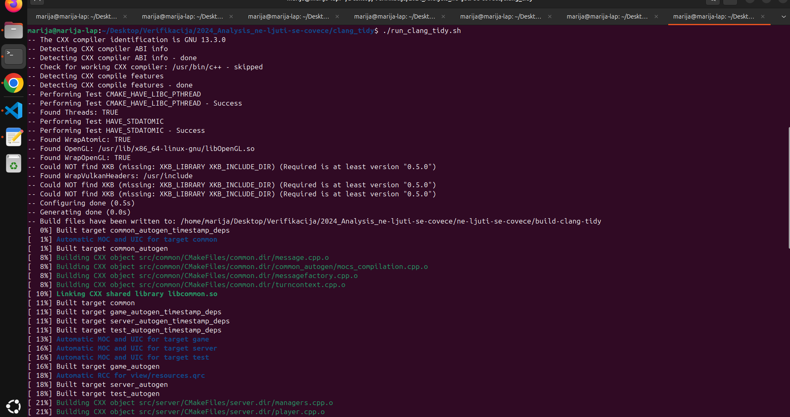
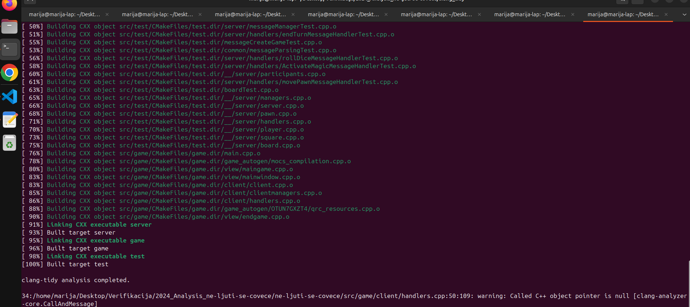
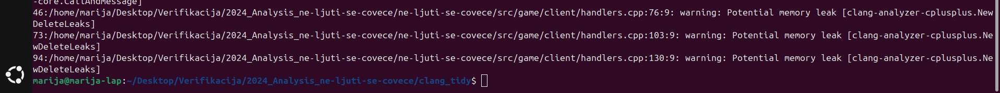
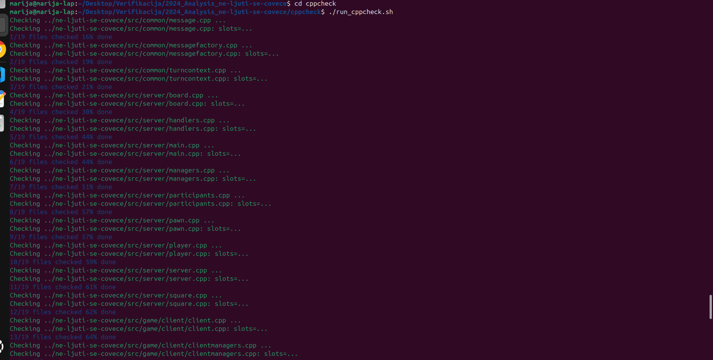
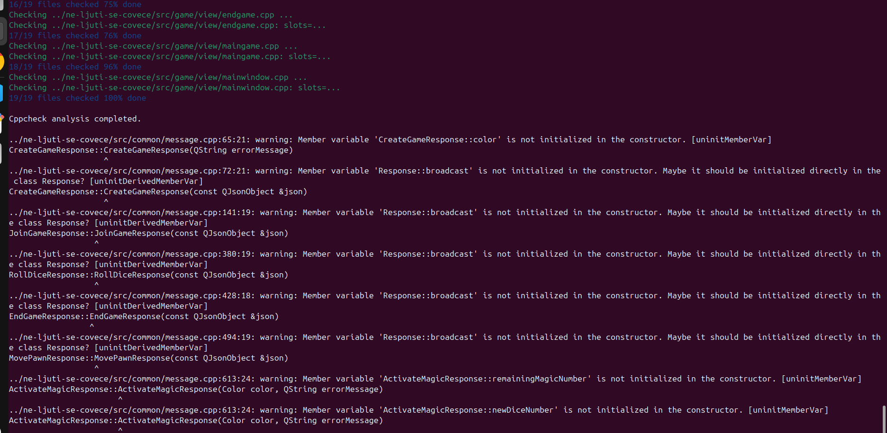
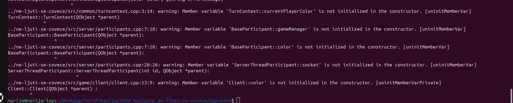
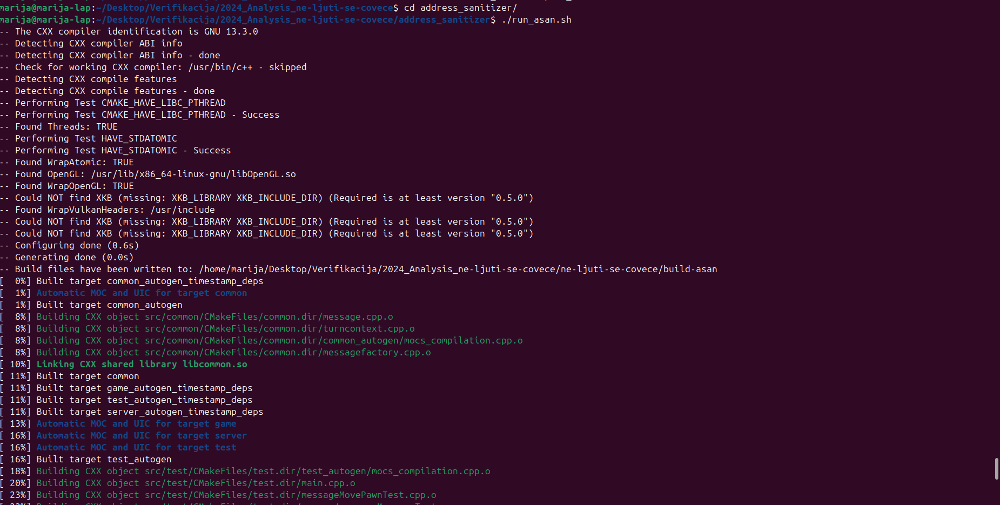
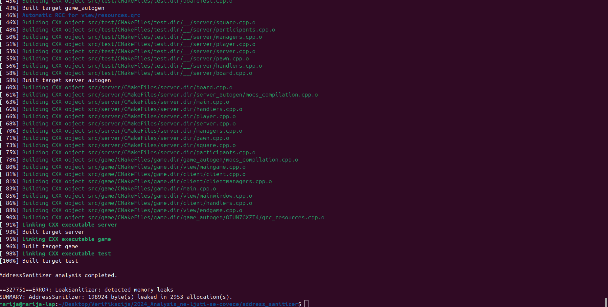
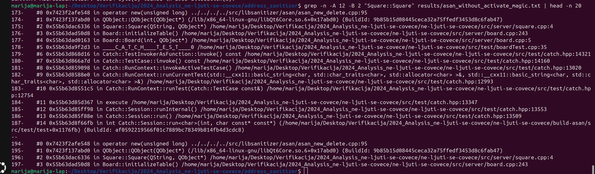

# Project Analysis Report

## Existing tests and code coverage

### Tool/technique

The analyzed project contains an existing Catch2 test suite. The existing tests were executed and code coverage was measured using LCOV.

This section is used as supporting analysis and baseline information. LCOV is not counted as a separate verification technique.

### Procedure

The project was configured and built in Debug mode with GCC coverage instrumentation enabled using the `--coverage` compiler flag.

After the build completed, the existing Catch2 test executable was run. LCOV was then used to collect coverage data. System headers, generated build files and test source files were excluded from the final coverage report.

The analysis can be reproduced using:

```bash
cd unit_tests
./run_tests.sh
```

### Running the analysis


### Test results

All existing tests passed successfully:

- 15 test cases
- 303 assertions
- 0 failed tests


### Code coverage results

- Line coverage: 73.2% (868/1185)
- Function coverage: 80.6% (179/222)
- Branch coverage: not collected


### Conclusion

The existing test suite provides good function coverage and moderate line coverage. Approximately 27% of the source lines are not executed by the current test suite.

---

## Valgrind Memcheck

### Tool

Valgrind Memcheck was used to detect memory-related problems such as use of uninitialized values, invalid memory access and memory leaks.

The analysis can be reproduced using:

```bash
cd valgrind
./run_valgrind.sh
```

### Running the analysis


### Test behavior under Memcheck

Under normal execution, all 15 test cases and all 303 assertions passed.

Under Valgrind Memcheck:

- 15 test cases
- 14 passed
- 1 failed
- 303 assertions
- 301 passed
- 2 failed

The failing assertions were in `ActivateMagicMessageHandlerTest`.


### Project-specific finding

Valgrind reported that conditional control flow depends on an uninitialized value in:

```text
ActivateMagicMessageHandler::handleMessage() - handlers.cpp:273
```

The same value was later used through:

```text
GameManager::isMagicAvailable() - managers.cpp:70
Board::getPlayer() - board.cpp:207
```

`TurnContext::reset()` initializes several state fields, but does not initialize:

```cpp
currentPlayerColor
```

The value is later returned by `getCurrentPlayerColor()` and is ultimately used in player indexing.


### Other Valgrind findings

Valgrind also reported invalid reads and memory leaks in Qt/Wayland/GTK-related code. These were not attributed directly to the analyzed project because their stack traces were located in external libraries.

### Memcheck summary


### Conclusion

Valgrind Memcheck detected a project-specific use of an uninitialized value. The field `TurnContext::currentPlayerColor` is not initialized before being used by game logic.

---

## Clang-Tidy

### Tool

Clang-Tidy was used for static analysis of the C++ source code in:

```text
src/common
src/server
src/game
```

The analysis can be reproduced using:

```bash
cd clang_tidy
./run_clang_tidy.sh
```

### Running the analysis



### Null pointer warning

The most important finding was reported in:

```text
src/game/client/handlers.cpp:50
```

Clang-Tidy reported:

```text
Called C++ object pointer is null
[clang-analyzer-core.CallAndMessage]
```

The warning refers to:

```cpp
response->prepareMessage()
```

The analyzer determined that the execution path can reach this expression while `response` is null.



### Potential memory leaks

Clang-Tidy also reported three potential memory leaks:

```text
handlers.cpp:76
handlers.cpp:103
handlers.cpp:130
```

The warnings are related to dynamically allocated `QWidget` objects passed to `QMessageBox` calls.



### Conclusion

Clang-Tidy found four project-specific warnings. The strongest finding is a possible null pointer dereference in `src/game/client/handlers.cpp`.

---

## Cppcheck

### Tool

Cppcheck was used for static analysis with focus on warnings, portability and performance issues.

The analysis was run over:

```text
src/common
src/server
src/game
```

The analysis can be reproduced using:

```bash
cd cppcheck
./run_cppcheck.sh
```

### Running the analysis



### Uninitialized members

Cppcheck reported multiple uninitialized member variables, including:

```text
CreateGameResponse::color
Response::broadcast
ActivateMagicResponse::remainingMagicNumber
ActivateMagicResponse::newDiceNumber
BaseParticipant::gameManager
BaseParticipant::color
ServerThreadParticipant::socket
Client::color
```



### TurnContext::currentPlayerColor

Cppcheck also reported:

```text
src/common/turncontext.cpp:3:14:
warning: Member variable 'TurnContext::currentPlayerColor'
is not initialized in the constructor. [uninitMemberVar]
```



This finding is particularly important because Valgrind Memcheck independently reported runtime use of an uninitialized value originating from the same `TurnContext` object.

### Conclusion

Cppcheck detected several project-specific cases of uninitialized member variables.

The strongest finding is `TurnContext::currentPlayerColor`, because it confirms the same defect already observed with Valgrind Memcheck.

---

## AddressSanitizer

### Tool

AddressSanitizer was used for dynamic memory analysis.

The project was compiled with:

```text
-fsanitize=address
-fno-omit-frame-pointer
```

Leak detection was enabled using:

```text
ASAN_OPTIONS=detect_leaks=1
```

The analysis can be reproduced using:

```bash
cd address_sanitizer
./run_asan.sh
```

### Running the analysis



### Full test suite behavior

The complete test suite did not finish under ASan.

Execution aborted in `ActivateMagicMessageHandlerTest` after Qt reported:

```text
ASSERT failure in QList::at: "index out of range"
```

The test process then terminated with `SIGABRT`.

Because the process aborted before the final leak report, the leak analysis was repeated while excluding:

```text
ActivateMagicMessageHandlerTest
```

using the Catch2 filter:

```text
~ActivateMagicMessageHandlerTest
```

### LeakSanitizer summary

The filtered run produced:

```text
ERROR: LeakSanitizer: detected memory leaks
SUMMARY: AddressSanitizer: 198924 byte(s) leaked in 2953 allocation(s).
```



### Direct leak interpretation

The inspected direct leak traces were located in external Qt/Wayland components such as:

```text
libwayland-client
Qt6WaylandClient
Qt6Gui
Qt6Widgets
```

These direct leaks were therefore not attributed directly to the analyzed project.

### Indirect leak traces through project code

Some indirect leak traces passed through:

```text
Square::Square(QString, QObject*)       src/server/square.cpp:4
Board::initializeTable()                src/server/board.cpp:243
Board::Board(int, QObject*)             src/server/board.cpp:5
```



These traces show that project objects are part of the retained allocation graph.

However, because the findings are indirect leaks, they do not by themselves prove that `Square` or `Board` are the root cause of the leak.

### Conclusion

AddressSanitizer and LeakSanitizer reported:

```text
198924 byte(s) leaked in 2953 allocation(s)
```

The direct leak traces that were inspected belonged to Qt/Wayland infrastructure and were not attributed directly to the project.

Indirect leak traces did pass through `Square` and `Board`, but additional ownership and lifetime analysis would be required to identify the exact root cause.

The full test suite also aborted due to an out-of-range `QList::at` assertion in `ActivateMagicMessageHandlerTest`, consistent with the previously observed unstable player-index state.
