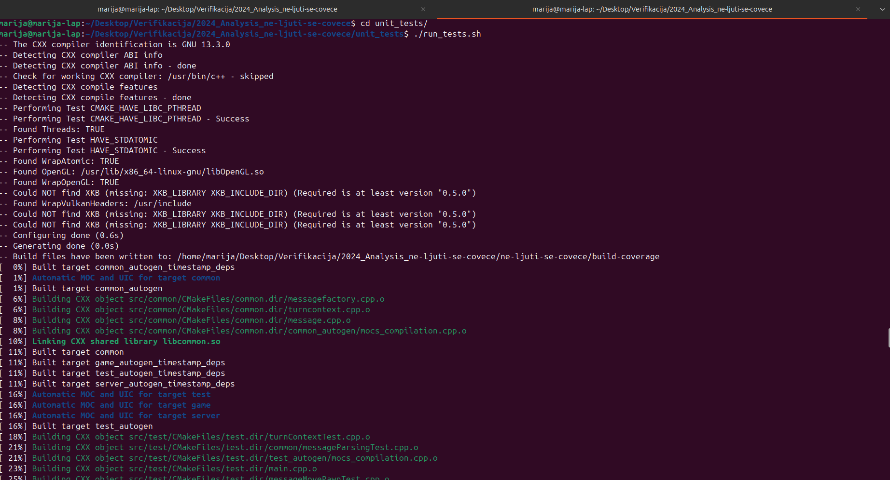
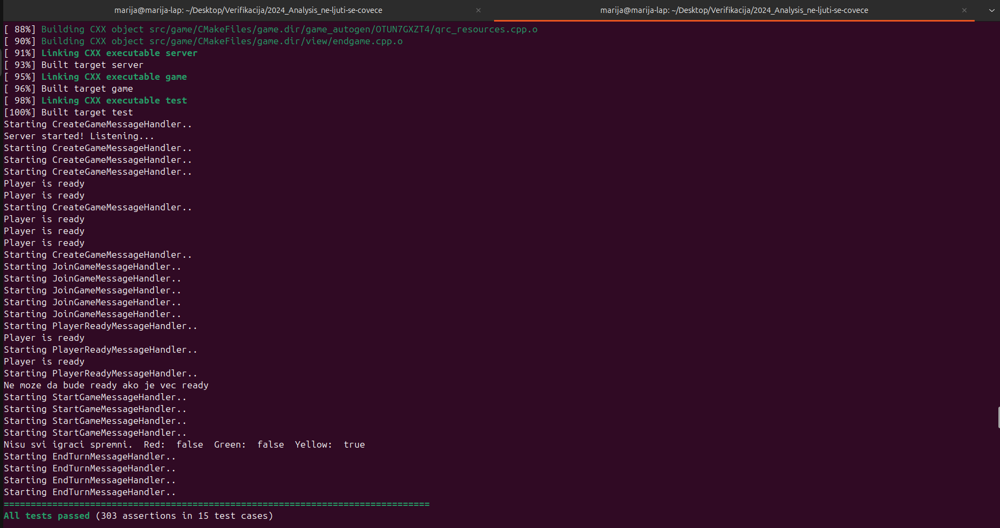
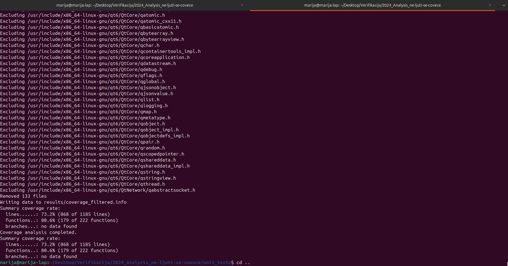
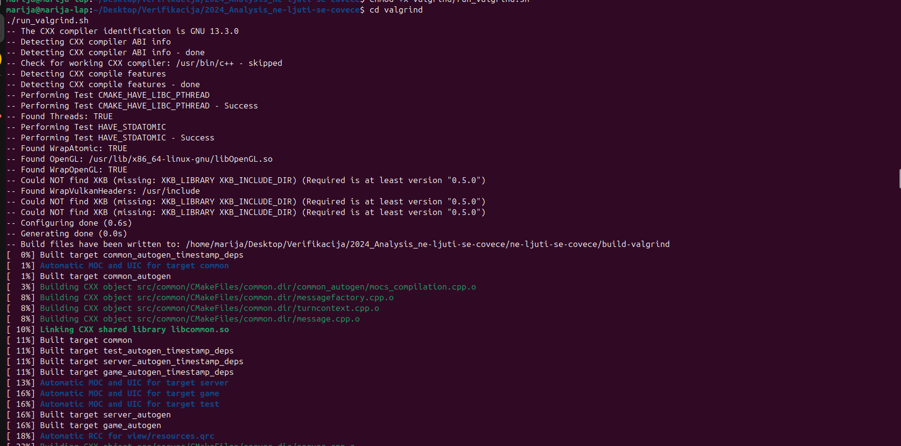
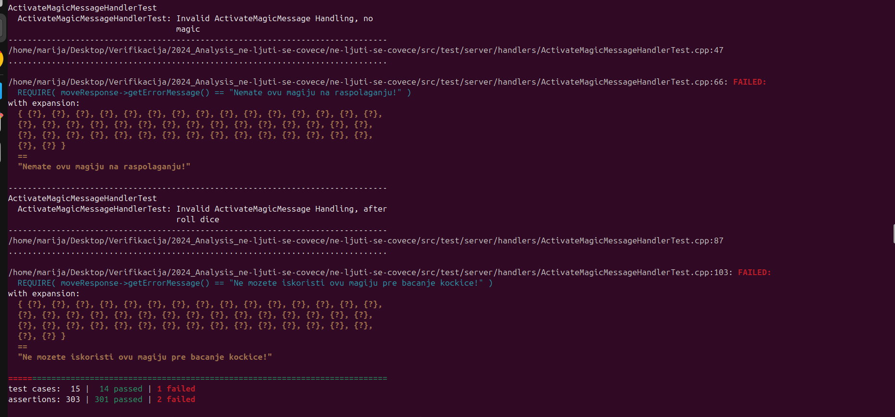
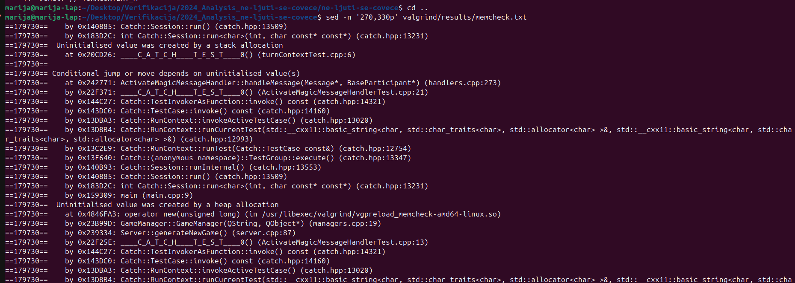
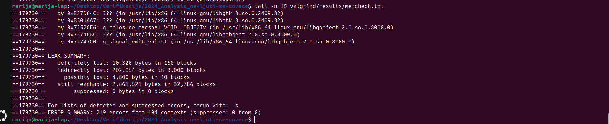

# Project Analysis Report

## Unit testing and code coverage

### Tool/technique

The analyzed project contains an existing Catch2 test suite. The tests were executed and code coverage was measured using LCOV.

### Procedure

The project was configured and built in Debug mode with GCC coverage instrumentation enabled using the `--coverage` compiler flag.

After the build completed, the existing Catch2 test executable was run. LCOV was then used to collect coverage data. System headers, generated build files and test source files were excluded from the final coverage report.

The analysis can be reproduced using:

```bash
cd unit_tests
./run_tests.sh
```

### Running the analysis



### Test results

All existing tests passed successfully:

- 15 test cases
- 303 assertions
- 0 failed tests



### Code coverage results

The resulting code coverage was:

- Line coverage: 73.2% (868/1185)
- Function coverage: 80.6% (179/222)
- Branch coverage: not collected



### Conclusion

The existing test suite provides good function coverage and moderate line coverage. Approximately 27% of the source lines are not executed by the current test suite, which indicates that additional edge cases and less frequently executed code paths could be covered by further testing.

---

## Valgrind Memcheck

### Tool

Valgrind Memcheck was used to detect memory-related problems such as use of uninitialized values, invalid memory access and memory leaks.

The analysis was performed on the existing Catch2 test executable.

The analysis can be reproduced using:

```bash
cd valgrind
./run_valgrind.sh
```

### Running the analysis



### Test behavior under Memcheck

When the test suite was executed normally, all 15 test cases and all 303 assertions passed.

Under Valgrind Memcheck, the result changed to:

- 15 test cases
- 14 passed
- 1 failed
- 303 assertions
- 301 passed
- 2 failed

The failing assertions were located in `ActivateMagicMessageHandlerTest`.



### Project-specific finding

Valgrind reported that conditional control flow depends on an uninitialized value in:

```text
ActivateMagicMessageHandler::handleMessage() - handlers.cpp:273
```

The same uninitialized value was later used through:

```text
GameManager::isMagicAvailable() - managers.cpp:70
Board::getPlayer() - board.cpp:207
```

The `TurnContext` constructor calls:

```cpp
this->reset();
```

However, `TurnContext::reset()` initializes:

```text
remainingNumberOfMoves
remainingNumberOfRolles
lastRolledValue
numberOfMagics
```

but does not initialize:

```cpp
currentPlayerColor
```

The value is later returned by:

```cpp
getCurrentPlayerColor()
```

and is ultimately used in:

```cpp
return this->players[color];
```

inside `Board::getPlayer()`.



### Other Valgrind findings

Valgrind also reported invalid reads and memory leaks in Qt/Wayland/GTK-related code.

Those findings were not attributed directly to the analyzed project because their stack traces were located in external platform and GUI libraries.

### Memcheck summary



### Conclusion

Valgrind Memcheck detected a project-specific use of an uninitialized value.

The field `TurnContext::currentPlayerColor` is not initialized by the constructor or by `TurnContext::reset()`, but it is later used by the game logic. This affects control flow and is eventually used as an index in `Board::getPlayer()`.

The changed behavior of `ActivateMagicMessageHandlerTest` under Valgrind is consistent with the presence of uninitialized state and makes this finding particularly relevant for the analysis.
